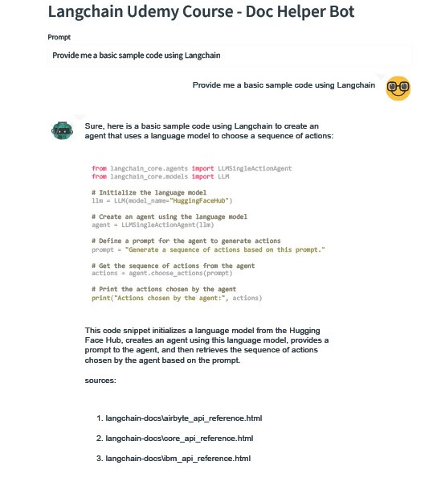

# Langchain Udemy Course - Doc Helper Bot

This project implements a chatbot using Streamlit and Langchain to provide interactive Q&A functionality based on specific documents or data. The bot takes user prompts, processes them using a language model, and returns relevant responses along with sources.

### Result

### Run Command
Run the Streamlit application using the following command:

- streamlit run main.py

